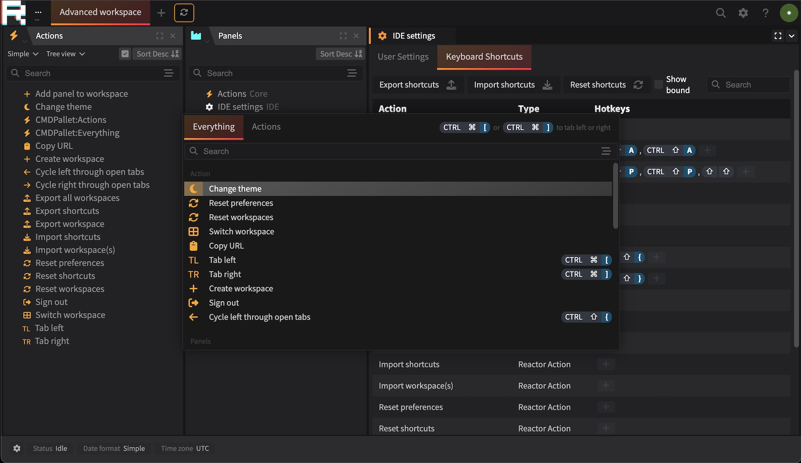

## Reactor

A framework for building ambitious web based applications. Reactor is the framework that powers [OXIDE (JourneyApps Platform IDE)](https://oxide.journeyapps.com), 
the [PowerSync dashboard](https://powersync.journeyapps.com) and other internal administration systems within JourneyApps.

__Features:__
* Desktop-grade multi-panel workspace support with drag and drop, tabs, tray and floating windows!
* Command based architecture with actions, shortcuts and intents!
* Cmd palette, right-click, tooltips & cross browser window interactions
* Declarative architecture for essentially everything
* Drag and drop everything (panels, tree entities, actions)
* Settings subsystem with forms, controls and pluggable storage
* Module system to enable and disable macro functionality.
* soo much more!

## Run Locally

1. Clone repo!
2. `pnpm install` in the root directory
3. `pnpm build` in the root directory
4. `cd ./demo/server && pnpm watch`
5. Navigate to `http://localhost:9527`

## Release

Release is done using changesets. Once a changeset is added, a release branch is created and upon merging, 
all changed packages are built and published automatically.