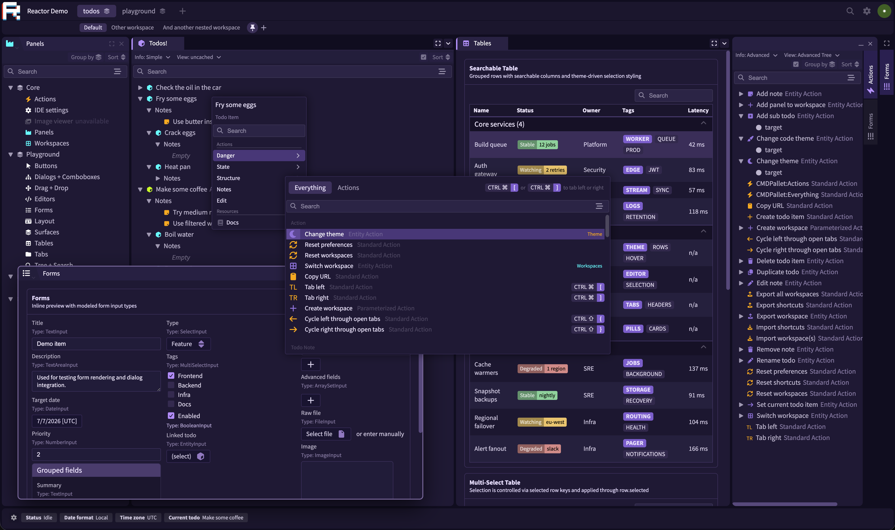

## Reactor

Reactor is a serious application framework for building ambitious, stateful, desktop-grade web software. It is the framework that powers
OXIDE (JourneyApps Platform IDE), Sector and other internal administration systems within JourneyApps.

Reactor provides the application shell, configurable workspace model, command system, theming layer, settings infrastructure
and extensibility primitives needed to build complex tools that behave like serious installed software while still running in
the browser. Reactor was originally designed to be the only framework we needed to build our primary IDE, but since its
conception we have come to see it as much more than that. Internally, we also use it for advanced administration systems and
feature-rich data browsing software. If you need to build an application with serious capability, Reactor's deeply declarative
model is almost certainly up to the task.

Docs: [https://journeyapps-labs.github.io/reactor](https://journeyapps-labs.github.io/reactor) (WIP)

News: [https://labs.journeyapps.com/blog/tags/reactor](https://labs.journeyapps.com/blog/tags/reactor)

__Core capabilities:__
* **Workspace runtime:** Multi-panel workspaces with drag and drop, tabs, trays, floating windows, split layouts and persistent workspace state.
* **Command architecture:** Actions, shortcuts, intents, command palettes and context menus are first-class primitives instead of one-off UI callbacks.
* **Adaptive interaction model:** Desktop interactions such as right-click menus, keyboard shortcuts and dense panels sit alongside mobile navigation, long-press menus and touch-focused layouts.
* **Declarative application structure:** Panels, entities, trees, tables, forms, toolbars, settings and actions can be composed from reusable models and widgets.
* **Extensible module system:** Reactor apps can install modules that add panels, actions, themes, settings, entities and other application-level behavior.
* **Theming and design system:** Shared theme fragments, surface primitives, icons, cards, lists, tabs and floating layers keep large applications visually coherent.
* **Settings and forms infrastructure:** Built-in form models, controls, validation hooks and pluggable storage make preferences and configuration screens a normal part of the platform.
* **Operational polish:** Tooltips, overlays, context menus, cross-window interactions, keyboard navigation and drag-and-drop workflows are built into the framework.

## Desktop Mode

|  |  |
| --- | --- |
|  |  |
|  |  |
|  |  |

## Mobile Mode

|  |  |  |
| --- | --- | --- |
|  |  |  |
|  |  |  |

## Run Locally

1. Clone repo!
2. `pnpm install` in the root directory
3. `pnpm build` in the root directory
4. `cd ./demo/server && pnpm watch`
5. Navigate to [http://localhost:9527](http://localhost:9527)

## Release

Release is done using changesets. Once a changeset is added, a release branch is created and upon merging, 
all changed packages are built and published automatically.
