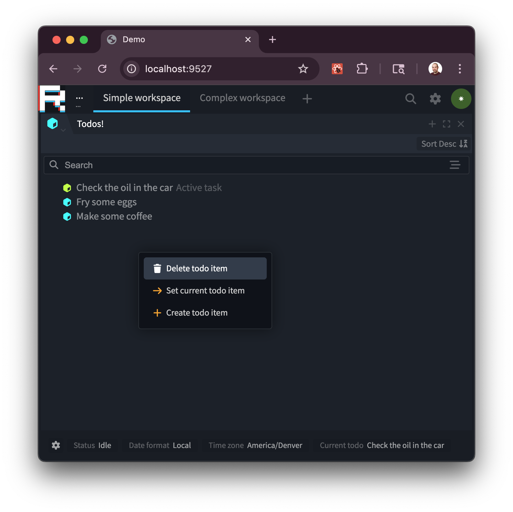
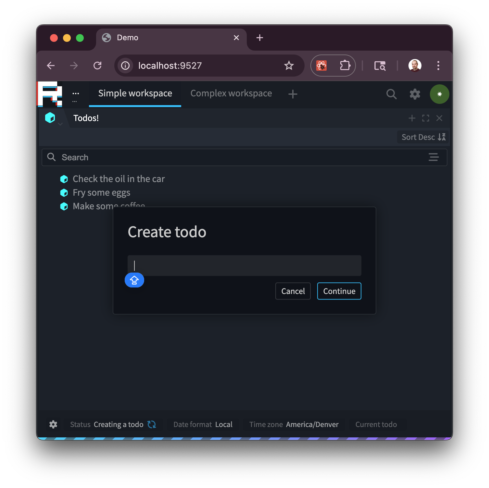

# Intro

Note:// These docs are still a work in progress.

To get an understanding of how Reactor makes it easy to build complex apps quickly, we suggest taking a look at the
`demo/module-demo` folder. This demo module showcases a simple Todo list system that allows you to create, delete and set the current todolist item.

## To get started:

1. Clone this repo
2. `pnpm install` (you may need to install pnpm via a tool such as homebrew)
3. `pnpm build`
4. `cd ./demo/server`
5. `pnpm watch`

